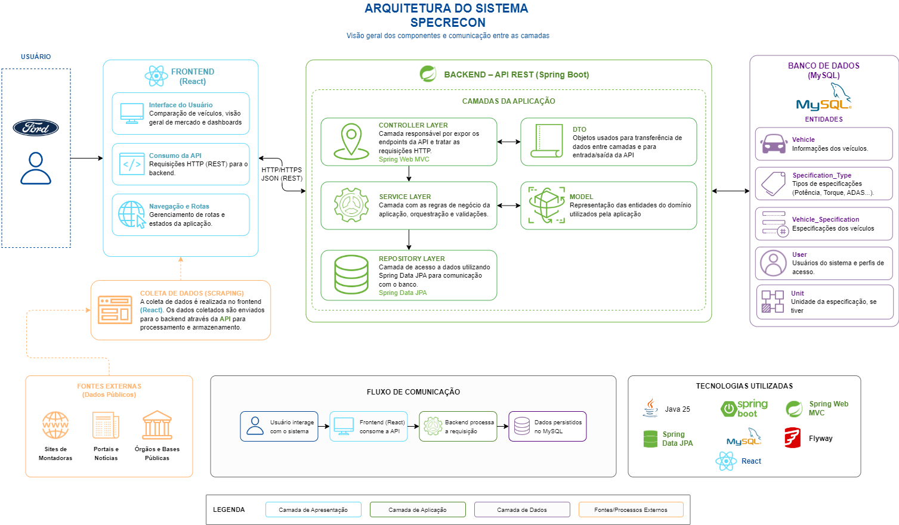

# 🔍 SpecRecon API

```Sistema de Gerenciamento de Veículos para Inteligência Estrategica da Ford```

Este repositório contém a implementação de uma API RESTful para gerenciamento de veículos, suas especificações técnicas e usuários, seguindo as melhores práticas de desenvolvimento em Java com Spring Boot.

## Indice

- [🏗️ 1. Desenho de Arquitetura e Componentes](#️-1-desenho-de-arquitetura-e-componentes)
- [🚀 2. Integração por Web Services (RESTful)](#-2-integração-por-web-services-restful)
- [🏛️ 3. Arquitetura Orientada a Serviços (SOA)](#️-3-arquitetura-orientada-a-serviços-soa)
- [🛠️ 4. Padrões e Boas Práticas](#️-4-padrões-e-boas-práticas)
- [💾 5. Conexão com Banco de Dados e Migrações](#-5-conexão-com-banco-de-dados-e-migrações)
- [🛡️ 6. Segurança (Resumo)](#️-6-segurança-resumo)
- [📝 7. Como Executar](#-7-como-executar)
- [⚒️ 8. Links Úteis](#️-8-links-úteis)


## 🏗️ 1. Desenho de Arquitetura e Componentes

A aplicação segue o modelo de **Arquitetura em Camadas**, promovendo a separação de responsabilidades e facilitando a manutenção e escalabilidade.

### Componentes Utilizados

- **Spring Boot 3.x**: Framework base para a construção da API Java.
- **Spring Security + JWT**: Autenticação e autorização stateless com suporte a RBAC.
- **Spring Data JPA / Hibernate**: Abstração da camada de persistência e ORM.
- **MySQL**: Banco de dados relacional para armazenamento persistente.
- **Flyway/Liquibase**: Controle de versionamento de esquemas de banco de dados (Migration).
- **Bucket4j**: Implementação de Rate Limiting para proteção contra abusos.
- **Jakarta Validation**: Validação de integridade de dados na entrada.
- **Swagger (OpenAPI 3)**: Documentação interativa da API.

### Fluxo de Requisição

`Client -> Controller (REST) -> DTO -> Service (Business Logic) -> Repository -> Database`

### Imagem da Arquitetura



## 🚀 2. Integração por Web Services (RESTful)

A API foi implementada seguindo os princípios **RESTful**, utilizando adequadamente os métodos HTTP e códigos de status para representar o estado dos recursos.

Uma coleção do Postman está disponível em `docs/postman_collection.json` para facilitar testes e integração. Mas recomenda-se acessar a documentação Swagger para uma visão completa dos endpoints e seus contratos.

### Endpoints Principais

#### **Veículos (`/vehicles`)**

| Método | Endpoint | Descrição |
|---|---|---|
| `GET` | `/vehicles` | Lista todos os veículos cadastrados. |
| `GET` | `/vehicles/{id}` | Busca detalhes e especificações de um veículo específico. |
| `POST` | `/vehicles` | Cria um novo veículo (Requer `X-Signature`). |
| `PUT` | `/vehicles/{id}` | Atualiza dados de um veículo existente. |
| `DELETE` | `/vehicles/{id}` | Remove um veículo do sistema. |

#### **Usuários & Auth (`/users` e `/auth`)**

| Método | Endpoint | Descrição |
|---|---|---|
| `POST` | `/auth/login` | Autentica usuário e retorna JWT + Refresh Token. |
| `POST` | `/auth/register` | Registro de novos usuários com validação de senha forte. |
| `GET` | `/users` | Lista usuários (Acesso restrito a ADMIN/ANALYST). |
| `PUT` | `/users/{id}` | Atualiza perfil de usuário e permissões (RBAC). |

#### **Tipos de Especificação (`/specification-types`)**

| Método | Endpoint | Descrição |
|---|---|---|
| `GET` | `/specification-types` | Lista categorias como "Motor", "Transmissão", etc. |
| `POST` | `/specification-types` | Cria novos tipos com validação de unidade (Ex: NUMBER precisa de unidade). |

#### ***Unidades de Medida (`/units`)**

| Método | Endpoint | Descrição |
|---|---|---|
| `GET` | `/units` | Lista todas as unidades de medida. |
| `POST` | `/units` | Cria uma nova unidade de medida (Ex: "km/h", "kg"). |

## 🏛️ 3. Arquitetura Orientada a Serviços (SOA)

O projeto foi construído com foco na **modularidade** e **reutilização**:

- **Organização Modular**: Cada entidade de domínio possui seu próprio pacote de serviço (`VehicleService`, `UserService`, `UnitService`), garantindo que a lógica de negócio seja independente e possa ser exposta para outros módulos ou sistemas.
- **Separação de Camadas**:
  - **Apresentação**: Controllers lidam apenas com o protocolo HTTP e conversão de DTOs.
  - **Serviço**: A `Service Layer` centraliza as regras de negócio (ex: validação de nomes únicos, regras de tipos de dados).
  - **Dados**: Repositories isolam o acesso ao banco de dados através do Spring Data JPA.

## 🛠️ 4. Padrões e Boas Práticas

### Padrões de Projeto

- **REST & JSON**: Toda a comunicação é baseada no padrão JSON com verbos HTTP semânticos.
- **DTO Pattern**: Uso de `Records` para transferir dados, evitando a exposição direta das entidades JPA e protegendo contra *mass assignment*.
- **Singleton**: Serviços e Beans gerenciados pelo Spring IoC.

### Tratamento de Erros e Exceções

A API utiliza um **Global Exception Handler** (`@ControllerAdvice`) que captura falhas e retorna um corpo de erro padronizado:

```json
{
  "timestamp": "2023-10-27T10:00:00",
  "status": 400,
  "error": "Bad Request",
  "message": "Unidade padrão é recomendada para NUMBER",
  "path": "/specification-types"
}
```

Isso garante que stack traces internos nunca sejam expostos ao cliente (conforme diretrizes de segurança).

## 💾 5. Conexão com Banco de Dados e Migrações

### Configuração de Conexão

A conexão é configurada via `application.properties`, utilizando variáveis de ambiente para segurança em produção:

```properties
spring.datasource.url=${DB_URL}
spring.datasource.username=${DB_USER}
spring.datasource.password=${DB_PASS}
spring.jpa.hibernate.ddl-auto=validate
```

### Controle de Migrações

O projeto utiliza controle de versionamento de banco de dados. Os scripts SQL estão localizados em `src/main/resources/db/migration/`.

- **V1**: Criação do esquema base (Veículos, Usuários, Especificações).
- **V2**: Adição de tabelas de auditoria e políticas de retenção de dados.

Isso permite que o banco de dados evolua de forma consistente em todos os ambientes (dev, staging, prod).

## 🛡️ 6. Segurança (Resumo)

Conforme detalhado no `SECURITY.md`:

- **HMAC Payload Signature**: Verificação de integridade no header `X-Signature`.
- **Criptografia AES-256**: Dados sensíveis (email de usuários e logs de auditoria) são criptografados em repouso no banco.
- **Rate Limiting**: Limite de 100 requisições por minuto por IP.
- **Sanitização**: Proteção contra XSS e SQL Injection via `SafeStringValidator`.
- **HTTPS/TLS 1.2+**: Comunicação criptografada com certificado PKCS12, keystore montado via volume Docker.

## 📝 7. Como Executar (Http)

1. Certifique-se de ter o **Java 17+** e **Maven** instalados.
2. Sincronize as dependências do projeto com:

   ```bash
   mvn clean install
   ```

3. Configure o arquivo `.env` com as chaves necessárias (`JWT_SECRET`, `DB_URL`, etc).
4. Digite `local` no Active profiler antes de rodar, para utilizar o `application-local.properties`.
5. Abra o Intellij e execute a classe `SpecReconApplication.java` ou execute o comando:

   ```bash
   mvn spring-boot:run
   ```
   
6. Acesse a documentação Swagger em: `http://localhost:8080/swagger-ui/index.html`

## 🐋 8. Como Executar (Docker - Https)

1. Configure o arquivo `.env` com as chaves necessárias (`JWT_SECRET`, `DB_URL`, etc).
2. Certifique-se de ter o Docker Desktop instalado e rodando.
3. Execute:
```bash
   docker compose up --build
```
4. Acesse o Swagger em: https://localhost:8443/swagger-ui/index.html

## 🧪 Como Testar via Swagger

### 1. Autenticação
- Acesse o Swagger em `https://localhost:8443/swagger-ui/index.html`
- Expanda o grupo **Autenticação** e use `POST /auth/register` para criar um usuário
- Use `POST /auth/login` com as mesmas credenciais e copie o `token` da resposta
- Clique no botão **Authorize** 🔒 no topo da página
- Cole o token e clique em **Authorize** → **Close**
- Todos os endpoints agora serão chamados com autenticação automática

### 2. Endpoints com X-Signature
Alguns endpoints (`POST /vehicles`, `POST /units`, `POST /specification-types`, `POST /users`, `PUT` e `DELETE` de cada um) exigem o header `X-Signature`.

A assinatura é gerada a partir do body da requisição. Execute no terminal Git Bash:

```bash
echo -n 'COLE_O_BODY_AQUI' | openssl dgst -sha256 -hmac "ixe9zAIWWX2xb0x92Vh2saWOWPOMnj0/OO5MONBvYlspovQ+ZvBoMJyq0btR0yOq" -binary | base64
```

Substitua `COLE_O_BODY_AQUI` pelo JSON exatamente como digitado no Swagger (sem espaços extras).

Cole a assinatura gerada no campo **X-Signature** que aparece nos parâmetros do endpoint e clique em **Execute**.

### 3. Fluxo recomendado
1. Registrar usuário ADMIN via `POST /auth/register`
2. Fazer login via `POST /auth/login` e copiar o token
3. Clicar em **Authorize** 🔒 e colar o token
4. Para endpoints com X-Signature, copiar o body → gerar assinatura → colar no campo
5. Executar o endpoint normalmente

### 4. Exemplo completo — criar um veículo

**Passo 1 — Registrar usuário:**
```json
{"email": "admin@ford.com", "password": "@Securepassword123", "role": "ADMIN"}
```

**Passo 2 — Fazer login e copiar o `token` da resposta:**
```json
{"email": "admin@ford.com", "password": "@Securepassword123"}
```

**Passo 3 — Clicar em Authorize 🔒, colar o token e confirmar**

**Passo 4 — Gerar a assinatura do body que vai enviar:**
```bash
echo -n '{"brand":"Ford","model":"Ranger","version":"Raptor"}' | openssl dgst -sha256 -hmac "ixe9zAIWWX2xb0x92Vh2saWOWPOMnj0/OO5MONBvYlspovQ+ZvBoMJyq0btR0yOq" -binary | base64
```

**Passo 5 — No Swagger, colar a assinatura no campo `X-Signature` e o body:**
```json
{"brand": "Ford", "model": "Ranger", "version": "Raptor"}
```
> ⚠️ O body digitado no Swagger deve ser **exatamente igual** ao usado para gerar a assinatura. Qualquer diferença de espaço ou ordem invalida a assinatura.

**Passo 6 — Clicar em Execute**

## 🧪 Script de Testes Automatizados

Um script bash completo está disponível para testar todos os 5 eixos de cybersecurity automaticamente.

Para rodar no Git Bash dentro da pasta `API/`:

```bash
bash test_specrecon.sh
```

O script cobre:
- ✅ Autenticação JWT, Refresh Token e RBAC
- ✅ Validação de entrada (XSS, SQL Injection, senha fraca)
- ✅ X-Signature HMAC e proteção de APIs
- ✅ Criptografia AES-256 no banco
- ✅ Trilha de auditoria completa
- ✅ Honeypot
- ✅ Rate Limiting

## ⚒️ 9. Links Úteis

- [Documentação Swagger](https://localhost:8443/swagger-ui/index.html)
- [Repositório do Projeto](https://github.com/L-A-N-E/API-SpecRecon)
- [Coleção Postman](docs/postman_collection.json)
- [Política de Segurança Detalhada](SECURITY.md)
