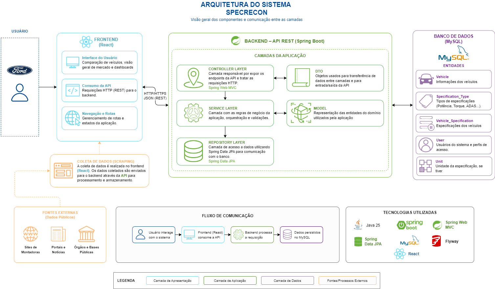
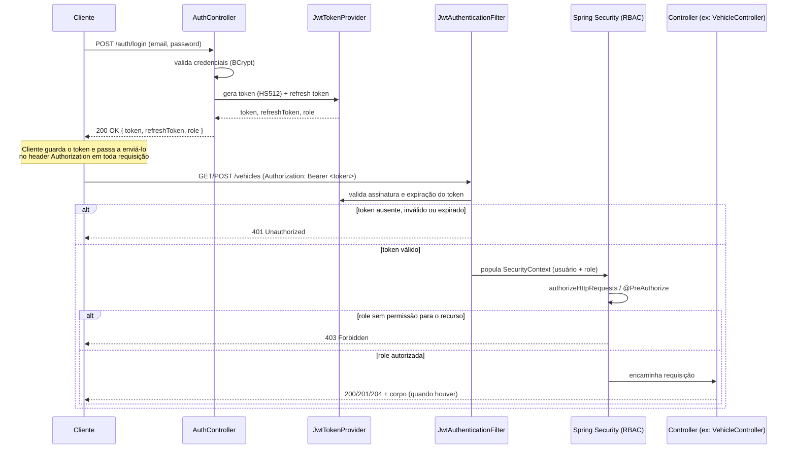

# 🔍 SpecRecon API

> **Sistema de Gerenciamento de Veículos para Inteligência Estratégica da Ford**

API RESTful desenvolvida em **Java + Spring Boot** para gerenciamento de veículos, especificações técnicas, unidades de medida e usuários, com autenticação, autorização, segurança e testes automatizados.

## 👥 Integrantes

| Integrante | RM |
|---|---:|
| Alice Santos Bulhões | RM554499 |
| Eduardo Oliveira Cardoso Madid | RM556349 |
| Nicolas Haubricht Hainfellner | RM556259 |
| Lucas Henzo Ide Yuki | RM554865 |
| Guilherme da Cunha Melo | RM555310 |

## 📚 Índice

- [🛠️ Tecnologias e Componentes](#🛠️-tecnologias-e-componentes)
- [🏗️ Arquitetura](#🏗️-arquitetura)
  - [Fluxo de Requisição](#fluxo-de-requisição)
  - [Diagrama de Componentes](#diagrama-de-componentes)
  - [Autenticação e Autorização](#autenticação-e-autorização)
  - [Perfis de Acesso (RBAC)](#perfis-de-acesso-rbac)
  - [Organização em Serviços (SOA)](#organização-em-serviços-soa)
- [🛡️ Segurança](#🛡️-segurança)
- [🚀 API REST - Endpoints](#🚀-api-rest--endpoints)
- [💾 Banco de Dados e Migrações](#💾-banco-de-dados-e-migrações)
- [▶️ Como Executar](#▶️-como-executar)
  - [Opção A - Local (HTTP)](#opção-a--local-http)
  - [Opção B - Docker (HTTPS)](#opção-b--docker-https)
- [🧪 Como Testar](#🧪-como-testar)
  - [Testes Manuais via Swagger](#testes-manuais-via-swagger)
  - [Testes Automatizados (JUnit)](#testes-automatizados-junit)
  - [Script de Cybersecurity](#script-de-cybersecurity)
- [🎥 Demonstração](#🎥-demonstração)
- [🔗 Links Úteis](#🔗-links-úteis)
- [🩹 Problemas ao rodar o projeto?](#🩹-problemas-ao-rodar-o-projeto)

---

## 🛠️ Tecnologias e Componentes

| Tecnologia / Componente | Utilização |
|---|---|
| **Spring Boot 3.x** | Framework base para construção da API Java |
| **Spring Security + JWT** | Autenticação e autorização stateless com RBAC |
| **Spring Data JPA / Hibernate** | Persistência e ORM |
| **MySQL** | Banco de dados relacional |
| **Flyway** | Controle de versionamento e migrações do banco |
| **Bucket4j** | Rate limiting para proteção contra abusos |
| **Jakarta Validation** | Validação dos dados de entrada |
| **Swagger / OpenAPI 3** | Documentação interativa da API |
| **JUnit 5** | Testes de integração |

## 🏗️ Arquitetura

A aplicação segue **Arquitetura em Camadas**, promovendo separação de responsabilidades e facilitando manutenção e escalabilidade.

### Fluxo de Requisição

```text
Client → Controller (REST) → DTO → Service (regras de negócio) → Repository → Database
```

### Diagrama de Componentes



### Autenticação e Autorização


```mermaid
sequenceDiagram
    participant C as Cliente
    participant Auth as AuthController
    participant JWT as JwtTokenProvider
    participant Filter as JwtAuthenticationFilter
    participant Sec as Spring Security (RBAC)
    participant Ctrl as Controller (ex: VehicleController)

    C->>Auth: POST /auth/login (email, password)
    Auth->>Auth: valida credenciais (BCrypt)
    Auth->>JWT: gera token (HS512) + refresh token
    JWT-->>Auth: token, refreshToken, role
    Auth-->>C: 200 OK { token, refreshToken, role }

    Note over C: Cliente guarda o token e passa a enviá-lo<br/>no header Authorization em toda requisição

    C->>Filter: GET/POST /vehicles (Authorization: Bearer <token>)
    Filter->>JWT: valida assinatura e expiração do token

    alt token ausente, inválido ou expirado
        Filter-->>C: 401 Unauthorized
    else token válido
        Filter->>Sec: popula SecurityContext (usuário + role)
        Sec->>Sec: authorizeHttpRequests / @PreAuthorize

        alt role sem permissão para o recurso
            Sec-->>C: 403 Forbidden
        else role autorizada
            Sec->>Ctrl: encaminha requisição
            Ctrl-->>C: 200/201/204 + corpo (quando houver)
        end
    end
```

**Resumo do fluxo:**

1. **Login** (`POST /auth/login`) - credenciais validadas com BCrypt; se corretas, o `JwtTokenProvider` emite um **JWT (HS512)** válido por 1h e um **refresh token** válido por 24h, ambos com `userId` e `role` nas claims.
2. **Requisições autenticadas** - o cliente envia `Authorization: Bearer <token>`; o `JwtAuthenticationFilter` valida assinatura e expiração e popula o `SecurityContext`.
3. **Autorização** - `SecurityFilterChainConfig` (por URL) e `@PreAuthorize` (por método) decidem o acesso: `401` (token ausente/inválido/expirado) ou `403` (token válido, sem permissão).
4. **Renovação** - `POST /auth/refresh` troca um refresh token válido por um novo par de tokens, sem novo login.

### Perfis de Acesso (RBAC)

| Perfil (`role`) | Permissões |
|---|---|
| `ADMIN` | Todos os endpoints, incluindo criar/editar/excluir usuários (`/users`) |
| `ANALYST` | Leitura de usuários (`GET /users`, `GET /users/{id}`) + acesso completo a veículos, unidades e tipos de especificação |
| `USER` | Acesso completo a veículos, unidades e tipos de especificação - sem acesso a `/users` |

**Endpoints públicos** (não exigem token): `POST /auth/login`, `POST /auth/register`, `POST /auth/refresh`, `/swagger-ui/**`, `/v3/api-docs/**`.

### Organização em Serviços (SOA)

Cada entidade de domínio tem seu próprio serviço (`VehicleService`, `UserService`, `UnitService`, ...), mantendo a lógica de negócio independente e reutilizável por outros sistemas.

| Camada | Responsabilidade |
|---|---|
| **Apresentação** | Controllers lidam com HTTP e conversão de DTOs |
| **Serviço** | Service Layer centraliza regras de negócio (ex.: nomes únicos, validação de tipos) |
| **Dados** | Repositories isolam o acesso ao banco via Spring Data JPA |

## 🛡️ Segurança

| Mecanismo | Descrição |
|---|---|
| **JWT + RBAC** | Autenticação stateless e controle de acesso por perfil |
| **BCrypt** | Hash e validação de senhas |
| **HMAC Payload Signature** | Verificação de integridade via header `X-Signature` |
| **AES-256** | Criptografia de dados sensíveis em repouso no banco |
| **Rate Limiting** | Limite de 100 requisições/minuto por IP |
| **Sanitização** | Proteção contra XSS e SQL Injection (`SafeStringValidator`) |
| **HTTPS / TLS 1.2+** | Comunicação criptografada com certificado PKCS12 |
| **Auditoria** | Registro de operações e trilha de auditoria |
| **Honeypot** | Endpoints-isca para detectar tentativas de invasão |

**Tratamento de erros:** um `GlobalExceptionHandler` (`@ControllerAdvice`) padroniza toda resposta de erro e evita expor stack traces:

```json
{
  "timestamp": "2023-10-27T10:00:00",
  "status": 400,
  "error": "Bad Request",
  "message": "Unidade padrão é recomendada para NUMBER",
  "path": "/specification-types"
}
```

📄 Detalhes completos em [`SECURITY.md`](API/SECURITY.md).

## 🚀 API REST - Endpoints

**Swagger (documentação interativa):**
- Local (HTTP): `http://localhost:8080/swagger-ui/index.html`
- Docker (HTTPS): `https://localhost:8443/swagger-ui/index.html`

### Veículos - `/vehicles`

| Método | Endpoint | Descrição |
|---|---|---|
| `GET` | `/vehicles` | Lista todos os veículos cadastrados |
| `GET` | `/vehicles/{id}` | Busca detalhes e especificações de um veículo |
| `POST` | `/vehicles` | Cria um novo veículo - requer `X-Signature` |
| `PUT` | `/vehicles/{id}` | Atualiza dados de um veículo |
| `DELETE` | `/vehicles/{id}` | Remove um veículo |

### Usuários e Autenticação - `/auth`, `/users`

| Método | Endpoint | Descrição |
|---|---|---|
| `POST` | `/auth/login` | Autentica usuário e retorna JWT + Refresh Token |
| `POST` | `/auth/register` | Registra um novo usuário com validação de senha forte |
| `GET` | `/users` | Lista usuários - acesso restrito a `ADMIN`/`ANALYST` |
| `PUT` | `/users/{id}` | Atualiza perfil e permissões do usuário |

### Tipos de Especificação - `/specification-types`

| Método | Endpoint | Descrição |
|---|---|---|
| `GET` | `/specification-types` | Lista categorias como Motor, Transmissão etc. |
| `POST` | `/specification-types` | Cria novos tipos com validação de unidade |

> Exemplo: tipos `NUMBER` podem exigir uma unidade de medida padrão.

### Unidades de Medida - `/units`

| Método | Endpoint | Descrição |
|---|---|---|
| `GET` | `/units` | Lista todas as unidades de medida |
| `POST` | `/units` | Cria uma nova unidade, como `km/h` ou `kg` |

## 💾 Banco de Dados e Migrações

A conexão é configurada via `application.properties` usando variáveis de ambiente (nunca credenciais hardcoded):

```properties
spring.datasource.url=${DB_URL}
spring.datasource.username=${DB_USER}
spring.datasource.password=${DB_PASS}
spring.jpa.hibernate.ddl-auto=validate
```

Migrações versionadas com Flyway em `src/main/resources/db/migration/`:

| Versão | Alterações |
|---|---|
| **V1** | Esquema base: veículos, usuários e especificações |
| **V2** | Tabelas de auditoria e políticas de retenção de dados |

## ▶️ Como Executar

Duas formas de rodar a aplicação. Escolha uma:

| | Opção A - Local | Opção B - Docker |
|---|---|---|
| Protocolo | HTTP | HTTPS |
| Uso indicado | Desenvolvimento/testes rápidos | Ambiente mais próximo de produção |
| Pré-requisito | Java 21 + MySQL local | Docker Desktop |

> ℹ️ O projeto alterna HTTP/HTTPS através de um *profile* do Spring (`local`). Se aparecerem erros de porta/TLS ou de conexão com o banco, veja [Problemas ao rodar o projeto?](#🩹-problemas-ao-rodar-o-projeto).

### Opção A - Local (HTTP)

**Pré-requisitos:** Java 21, Maven (ou o wrapper `mvnw`/`mvnw.cmd` incluso), MySQL acessível em `localhost:3306`.

```bash
# 1. Instalar dependências
mvn clean install          # ou: ./mvnw clean install

# 2. Definir credenciais do banco (ou usar um arquivo .env - ver abaixo)
export DB_USER=root
export DB_PASS=sua_senha_real

# 3. Rodar com o profile "local" (ativa HTTP na porta 8080)
./mvnw spring-boot:run -Dspring-boot.run.profiles=local
```

No Windows (PowerShell), use `.\mvnw.cmd` no lugar de `./mvnw` e `$env:DB_USER="root"` no lugar de `export`.

Alternativa: crie um arquivo `.env` na raiz de `API/` com `JWT_SECRET`, `DB_URL`, `DB_USER`, `DB_PASS` - ele é carregado automaticamente.

Garanta que o usuário exista no MySQL:
```sql
CREATE USER IF NOT EXISTS 'specrecon'@'localhost' IDENTIFIED BY 'specreconpass';
GRANT ALL PRIVILEGES ON specrecon.* TO 'specrecon'@'localhost';
FLUSH PRIVILEGES;
```

**Acesse:** `http://localhost:8080/swagger-ui/index.html`

### Opção B - Docker (HTTPS)

**Pré-requisito:** Docker Desktop em execução.

```bash
# 1. Configure o .env na raiz de API/ com: JWT_SECRET, DB_URL, DB_USER, DB_PASS

# 2. Se houver um MySQL local rodando na porta 3306, pare-o antes (evita conflito)

# 3. Suba os containers
docker compose up --build
```

**Acesse:** `https://localhost:8443/swagger-ui/index.html`

## 🧪 Como Testar

Três formas de validar a aplicação:

### Testes Manuais via Swagger

1. Acesse o Swagger (`http://localhost:8080/swagger-ui/index.html` ou a URL HTTPS do Docker).
2. Em **Autenticação**, execute `POST /auth/register` e depois `POST /auth/login`.
3. Copie o `token` retornado, clique em **Authorize 🔒**, cole o token e confirme.
4. Endpoints protegidos já podem ser chamados normalmente.

**Endpoints que exigem o header `X-Signature`** (assinatura HMAC-SHA256 do body): `POST /vehicles`, `POST /units`, `POST /specification-types`, `POST /users`, e todas as operações `PUT`/`DELETE`.

```bash
# Gerar a assinatura a partir do body exato que será enviado
echo -n '{"brand":"Ford","model":"Ranger","version":"Raptor"}' \
  | openssl dgst -sha256 -hmac "<chave>" -binary | base64
```

> ⚠️ O body usado para gerar a assinatura deve ser **idêntico** (mesmos espaços e ordem de campos) ao body enviado na requisição.

**Exemplo completo - criar um veículo:** registrar usuário `ADMIN` → login → copiar token → Authorize no Swagger → gerar `X-Signature` para o body → executar `POST /vehicles` com o header preenchido.

### Testes Automatizados (JUnit)

Testes de integração que sobem o contexto completo (Security, JWT, interceptors, banco, endpoints) cobrindo sucesso, erros de validação, recursos inexistentes e falhas de autenticação/autorização.

| Classe | Cenários |
|---|---|
| `AuthFlowTest` | Registro (`201`), e-mail duplicado (`409`), senha fraca (`400`), login válido (`200`), senha incorreta (`401`) |
| `VehicleAccessAndCrudTest` | Sem token (`401`), listagem autenticada (`200`), criação (`201`), corpo inválido (`400`), inexistente (`404`), criação + exclusão (`204`) |
| `UserAccessControlTest` | Sem token (`401`), perfil `USER` em `/users` (`403`), perfil `ADMIN` em `/users` (`200`) |

**Opção 1 - Docker (recomendado):** sobe um MySQL isolado e roda os testes automaticamente.
```bash
docker compose -f docker-compose.test.yml up --build --abort-on-container-exit
```

**Opção 2 - MySQL local:** requer um MySQL em `localhost:3306` com permissões de `CREATE`/`ALTER` no schema `specrecon_test` (usuário/senha padrão: `root`/`specreconpass`, sobrescrevíveis via `DB_URL`/`DB_USER`/`DB_PASS`).
```bash
cd API
mvn test          # ou: ./mvnw clean test
```

> Problemas com variáveis de ambiente "vazando" entre Docker e execução local? Veja [Problemas ao rodar o projeto?](#🩹-problemas-ao-rodar-o-projeto).

### Script de Cybersecurity

Script Bash que valida JWT, refresh token, RBAC, validação de entrada, proteção XSS/SQL Injection, senha fraca, `X-Signature`, criptografia AES-256, auditoria, honeypot e rate limiting.

```bash
cd API
bash test_specrecon.sh
```

> Requer `.env` configurado e o MySQL disponível via Docker.

## 🎥 Demonstração

▶️ **[Assistir ao vídeo da API no YouTube](https://www.youtube.com/watch?v=pPPahV5tn5Y)**

## 🔗 Links Úteis

| Recurso | Link |
|---|---|
| 📖 Swagger - Local (HTTP) | `http://localhost:8080/swagger-ui/index.html` |
| 📖 Swagger - Docker (HTTPS) | `https://localhost:8443/swagger-ui/index.html` |
| 💻 Repositório | [GitHub - API-SpecRecon](https://github.com/L-A-N-E/API-SpecRecon) |
| 🛡️ Política de Segurança | [SECURITY.md](API/SECURITY.md) |
| 🎥 Vídeo | [Tutorial da API no YouTube](https://www.youtube.com/watch?v=pPPahV5tn5Y) |

## 🩹 Problemas ao rodar o projeto?

A explicação de como o Spring Boot combina `application.properties` + profile `local` + variáveis de ambiente, e a tabela de erros comuns (porta/TLS, credenciais de banco, variáveis "vazando" entre execuções), foi movida para **[docs/TROUBLESHOOTING.md](docs/TROUBLESHOOTING.md)** para manter este README focado em "como rodar", sem misturar com "por que deu erro".