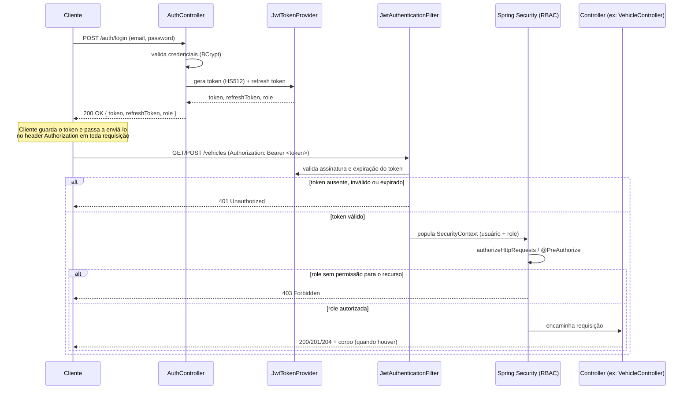

# 🔍 SpecRecon API

> **Sistema de Gerenciamento de Veículos para Inteligência Estratégica da Ford**

API RESTful desenvolvida em **Java + Spring Boot** para gerenciamento de veículos, especificações técnicas, unidades de medida e usuários, com autenticação, autorização, segurança e testes automatizados.

## 👥 Integrantes

| Integrante | RM |
|---|---:|
| Alice Santos Bulhões | RM554499 |
| Eduardo Oliveira Cardoso Madid | RM556349 |
| Nicolas Haubricht Hainfellner | RM556259 |
| Lucas Henzo Ide Yuki | RM554865 |
| Guilherme da Cunha Melo | RM555310 |

## 📚 Índice

- [🛠️ Tecnologias e Componentes](#️-tecnologias-e-componentes)
- [🏗️ Arquitetura da Aplicação](#️-arquitetura-da-aplicação)
  - [Fluxo de Requisição](#fluxo-de-requisição)
  - [Arquitetura](#arquitetura)
  - [Fluxo de Comunicação e Autenticação](#fluxo-de-comunicação-e-autenticação)
  - [Perfis de Acesso (RBAC)](#perfis-de-acesso-rbac)
  - [Arquitetura Orientada a Serviços (SOA)](#arquitetura-orientada-a-serviços-soa)
- [🛡️ Segurança](#️-segurança)
  - [Mecanismos de Segurança](#mecanismos-de-segurança)
  - [Tratamento de Erros](#tratamento-de-erros)
- [🚀 API RESTful](#-api-restful)
  - [Swagger](#swagger)
  - [Veículos](#veículos)
  - [Usuários e Autenticação](#usuários-e-autenticação)
  - [Tipos de Especificação](#tipos-de-especificação)
  - [Unidades de Medida](#unidades-de-medida)
- [💾 Banco de Dados e Migrações](#-banco-de-dados-e-migrações)
- [▶️ Como Executar](#️-como-executar)
  - [Execução Local - HTTP](#execução-local--http)
  - [Execução com Docker - HTTPS](#execução-com-docker--https)
- [🧪 Como Testar](#-como-testar)
  - [Testes via Swagger](#testes-via-swagger)
  - [Testes Automatizados com JUnit](#testes-automatizados-com-junit)
  - [Script de Cybersecurity](#script-de-cybersecurity)
- [🎥 Demonstração](#-demonstração)
- [🔗 Links Úteis](#-links-úteis)

# 🛠️ Tecnologias e Componentes

A aplicação utiliza uma arquitetura baseada em camadas e os seguintes componentes:

| Tecnologia / Componente | Utilização |
|---|---|
| **Spring Boot 3.x** | Framework base para construção da API Java |
| **Spring Security + JWT** | Autenticação e autorização stateless com RBAC |
| **Spring Data JPA / Hibernate** | Persistência e ORM |
| **MySQL** | Banco de dados relacional |
| **Flyway/Liquibase** | Controle de versionamento e migrações do banco |
| **Bucket4j** | Rate Limiting para proteção contra abusos |
| **Jakarta Validation** | Validação dos dados de entrada |
| **Swagger / OpenAPI 3** | Documentação interativa da API |
| **JUnit 5** | Testes unitários |

# 🏗️ Arquitetura da Aplicação

A aplicação segue o modelo de **Arquitetura em Camadas**, promovendo separação de responsabilidades e facilitando manutenção e escalabilidade.

## Fluxo de Requisição

O fluxo principal de uma requisição é:

```text
Client
  ↓
Controller (REST)
  ↓
DTO
  ↓
Service (Business Logic)
  ↓
Repository
  ↓
Database
```

## Arquitetura


## Fluxo de Comunicação e Autenticação

Todo endpoint protegido segue o fluxo abaixo, desde o login até a liberação ou negação de acesso ao recurso:


```mermaid
sequenceDiagram
    participant C as Cliente
    participant Auth as AuthController
    participant JWT as JwtTokenProvider
    participant Filter as JwtAuthenticationFilter
    participant Sec as Spring Security (RBAC)
    participant Ctrl as Controller (ex: VehicleController)

    C->>Auth: POST /auth/login (email, password)
    Auth->>Auth: valida credenciais (BCrypt)
    Auth->>JWT: gera token (HS512) + refresh token
    JWT-->>Auth: token, refreshToken, role
    Auth-->>C: 200 OK { token, refreshToken, role }

    Note over C: Cliente guarda o token e passa a enviá-lo<br/>no header Authorization em toda requisição

    C->>Filter: GET/POST /vehicles (Authorization: Bearer <token>)
    Filter->>JWT: valida assinatura e expiração do token

    alt token ausente, inválido ou expirado
        Filter-->>C: 401 Unauthorized
    else token válido
        Filter->>Sec: popula SecurityContext (usuário + role)
        Sec->>Sec: authorizeHttpRequests / @PreAuthorize

        alt role sem permissão para o recurso
            Sec-->>C: 403 Forbidden
        else role autorizada
            Sec->>Ctrl: encaminha requisição
            Ctrl-->>C: 200/201/204 + corpo (quando houver)
        end
    end
```

### Resumo do fluxo de autenticação

1. **Login - `POST /auth/login`**
   - As credenciais são validadas com BCrypt.
   - Se estiverem corretas, o `JwtTokenProvider` emite um **JWT (HS512)** válido por 1 hora.
   - Também é emitido um **refresh token** válido por 24 horas.
   - Ambos contêm `userId` e `role` nas claims.

2. **Requisições autenticadas**
   - O cliente envia o token no header:
     ```text
     Authorization: Bearer <token>
     ```
   - O `JwtAuthenticationFilter` intercepta a requisição.
   - A assinatura e a expiração são validadas.
   - Se o token for válido, o `SecurityContext` do Spring Security é preenchido com o usuário e sua `role`.

3. **Autorização**
   - O `SecurityFilterChainConfig` controla permissões por URL através de `authorizeHttpRequests`.
   - Permissões também podem ser controladas por método utilizando `@PreAuthorize`.
   - Quando aplicável:
     - `401 Unauthorized`: token ausente, inválido ou expirado.
     - `403 Forbidden`: token válido, mas sem permissão.

4. **Renovação**
   - Quando o token expira, o cliente pode utilizar:
     ```text
     POST /auth/refresh
     ```
   - O refresh token permite obter um novo par de tokens sem realizar login novamente.

## Perfis de Acesso (RBAC)

| Perfil (`role`) | Permissões |
|---|---|
| `ADMIN` | Todos os endpoints, incluindo criação, edição e exclusão de usuários (`/users`) |
| `ANALYST` | Leitura de usuários (`GET /users`, `GET /users/{id}`) e acesso completo a veículos, unidades e tipos de especificação |
| `USER` | Acesso completo a veículos, unidades e tipos de especificação, sem acesso a `/users` |

### Endpoints públicos

Não exigem token:

- `POST /auth/login`
- `POST /auth/register`
- `POST /auth/refresh`
- `/swagger-ui/**`
- `/v3/api-docs/**`

## Arquitetura Orientada a Serviços (SOA)

O projeto foi construído com foco em **modularidade** e **reutilização**.

### Organização Modular

Cada entidade de domínio possui seu próprio serviço:

- `VehicleService`
- `UserService`
- `UnitService`

Isso mantém a lógica de negócio independente e permite que os módulos sejam expostos ou reutilizados por outros sistemas.

### Separação de Camadas

| Camada | Responsabilidade |
|---|---|
| **Apresentação** | Controllers lidam com HTTP e conversão de DTOs |
| **Serviço** | Service Layer centraliza regras de negócio |
| **Dados** | Repositories isolam o acesso ao banco via Spring Data JPA |

Exemplos de regras de negócio incluem validação de nomes únicos e validação de tipos de dados.

# 🛡️ Segurança

Os mecanismos de segurança da aplicação estão detalhados no arquivo [`SECURITY.md`](https://github.com/L-A-N-E/API-SpecRecon/blob/main/API/SECURITY.md).

## Mecanismos de Segurança

| Mecanismo | Descrição |
|---|---|
| **JWT + RBAC** | Autenticação stateless e controle de acesso por perfil |
| **BCrypt** | Validação e proteção de senhas |
| **HMAC Payload Signature** | Verificação de integridade através do header `X-Signature` |
| **AES-256** | Criptografia de dados sensíveis em repouso no banco |
| **Rate Limiting** | Limite de 100 requisições por minuto por IP |
| **Sanitização** | Proteção contra XSS e SQL Injection através do `SafeStringValidator` |
| **HTTPS / TLS 1.2+** | Comunicação criptografada utilizando certificado PKCS12 |
| **Auditoria** | Registro de operações e trilha de auditoria |
| **Honeypot** | Mecanismo adicional contemplado no script de cybersecurity |

## Tratamento de Erros

A API utiliza um **Global Exception Handler** (`@ControllerAdvice`) para capturar falhas e retornar respostas padronizadas.

Exemplo:

```json
{
  "timestamp": "2023-10-27T10:00:00",
  "status": 400,
  "error": "Bad Request",
  "message": "Unidade padrão é recomendada para NUMBER",
  "path": "/specification-types"
}
```

Essa abordagem evita a exposição de stack traces internos ao cliente.

# 🚀 API RESTful

A API segue os princípios **RESTful**, utilizando métodos HTTP e códigos de status apropriados para representar as operações sobre os recursos.

## Swagger

A documentação interativa está disponível através do Swagger:

- **HTTP:** `http://localhost:8080/swagger-ui/index.html`
- **HTTPS / Docker:** `https://localhost:8443/swagger-ui/index.html`

## Veículos

Base URL:

```text
/vehicles
```

| Método | Endpoint | Descrição |
|---|---|---|
| `GET` | `/vehicles` | Lista todos os veículos cadastrados |
| `GET` | `/vehicles/{id}` | Busca detalhes e especificações de um veículo |
| `POST` | `/vehicles` | Cria um novo veículo - requer `X-Signature` |
| `PUT` | `/vehicles/{id}` | Atualiza dados de um veículo |
| `DELETE` | `/vehicles/{id}` | Remove um veículo |

## Usuários e Autenticação

Bases:

```text
/auth
/users
```

| Método | Endpoint | Descrição |
|---|---|---|
| `POST` | `/auth/login` | Autentica usuário e retorna JWT + Refresh Token |
| `POST` | `/auth/register` | Registra um novo usuário com validação de senha forte |
| `GET` | `/users` | Lista usuários - acesso restrito a `ADMIN`/`ANALYST` |
| `PUT` | `/users/{id}` | Atualiza perfil e permissões do usuário |

## Tipos de Especificação

Base URL:

```text
/specification-types
```

| Método | Endpoint | Descrição |
|---|---|---|
| `GET` | `/specification-types` | Lista categorias como Motor, Transmissão etc. |
| `POST` | `/specification-types` | Cria novos tipos com validação de unidade |

> Exemplo: tipos `NUMBER` podem exigir uma unidade de medida padrão.

## Unidades de Medida

Base URL:

```text
/units
```

| Método | Endpoint | Descrição |
|---|---|---|
| `GET` | `/units` | Lista todas as unidades de medida |
| `POST` | `/units` | Cria uma nova unidade, como `km/h` ou `kg` |

# 💾 Banco de Dados e Migrações

## Configuração da Conexão

A conexão com o banco é configurada através do `application.properties`, utilizando variáveis de ambiente para evitar o armazenamento direto de credenciais.

```properties
spring.datasource.url=${DB_URL}
spring.datasource.username=${DB_USER}
spring.datasource.password=${DB_PASS}
spring.jpa.hibernate.ddl-auto=validate
```

## Migrações

Os scripts SQL ficam em:

```text
src/main/resources/db/migration/
```

As versões descritas no projeto são:

| Versão | Alterações |
|---|---|
| **V1** | Criação do esquema base: veículos, usuários e especificações |
| **V2** | Adição de tabelas de auditoria e políticas de retenção de dados |

O versionamento permite que o banco evolua de forma consistente entre os ambientes de desenvolvimento, staging e produção.

# ▶️ Como Executar

Existem duas formas principais de executar a aplicação:

1. **Execução local utilizando HTTP** (mais simples para desenvolvimento/testes)
2. **Execução através do Docker utilizando HTTPS** (mais próximo de produção)

## Como o Spring Boot decide a configuração (leia antes de rodar)

Antes de seguir os passos, entenda essas três peças - elas explicam praticamente todo problema de configuração que aparece ao rodar o projeto:

**1. `application.properties` sempre é carregado primeiro (base).**
Ele define, por padrão, HTTPS na porta `8443` (pensado para o cenário Docker/produção):
```properties
server.ssl.enabled=true
server.port=8443
```

**2. Um "profile" ativo carrega um arquivo adicional que sobrescreve a base.**
O projeto tem o profile `local` (`application-local.properties`), que desliga o SSL e usa a porta `8080`:
```properties
server.ssl.enabled=false
server.port=8080
```
Sem ativar esse profile, a aplicação sempre volta ao padrão HTTPS/8443 - **é por isso que abrir `http://localhost:8443` no navegador dá o erro "Bad Request: this combination of host and port requires TLS"**: a porta 8443 só existe em modo HTTPS quando o profile `local` não está ativo.

Para ativar o profile `local`, existem duas formas equivalentes (use uma, não as duas):
```powershell
# Opção A - flag na hora de rodar (vale só para essa execução)
.\mvnw.cmd spring-boot:run -Dspring-boot.run.profiles=local

# Opção B - variável de ambiente (vale para toda a sessão do terminal)
$env:SPRING_PROFILES_ACTIVE="local"
.\mvnw.cmd spring-boot:run
```

**3. Variáveis de ambiente sempre "ganham" dos valores dentro dos arquivos `.properties`.**
Sempre que você vir algo como `${DB_USER:root}` num `.properties`, isso significa "use a variável de ambiente `DB_USER`; se ela não existir, use `root` como padrão". Ou seja:
- Se você **não** definiu a variável, vale o valor depois dos dois-pontos (o padrão).
- Se você **definiu** a variável em algum momento no PowerShell, ela **continua valendo em qualquer comando seguinte na mesma janela**, mesmo que o comando seja de um contexto diferente (teste, run, outro profile). Isso é a causa mais comum de confusão: uma variável `DB_USER`/`DB_PASS`/`DB_URL` definida há vários comandos atrás "vaza" para a execução atual e faz a aplicação tentar logar no banco com credenciais que não são as que você esperava agora.

**Resumindo em uma frase:** o resultado final de qualquer execução = `application.properties` + arquivo do profile ativo (se houver) + variáveis de ambiente definidas na sessão do terminal (que sempre têm a palavra final). Se algo não bate com o esperado, confira essas três camadas nessa ordem.

## Execução Local - HTTP

### Pré-requisitos

- Java 17+ (o projeto usa Java 21)
- Maven (ou o wrapper `mvnw`/`mvnw.cmd` já incluso no projeto, que não exige instalação)
- MySQL acessível em `localhost:3306`, com um usuário que tenha permissão de criar/alterar tabelas no banco `specrecon` (esse é o schema usado no profile `local` - os testes automatizados usam um banco separado, `specrecon_test`, veja a seção de testes)

### 1. Instalar dependências

```bash
mvn clean install
```
ou, sem o Maven instalado:
```powershell
.\mvnw.cmd clean install
```

### 2. Configurar as credenciais do banco

O jeito mais simples para desenvolvimento local é definir as variáveis de ambiente na sessão do terminal antes de rodar (assim você não precisa editar nenhum arquivo, e nada fica salvo permanentemente):

```powershell
$env:DB_USER="root"          # ou o usuário que você criou no MySQL
$env:DB_PASS="sua_senha_real"
```

Alternativamente, você pode configurar essas chaves em um arquivo `.env` na raiz de `API/` (o projeto já carrega esse arquivo automaticamente via `spring.config.import` no `application.properties`):
```text
JWT_SECRET=...
DB_URL=jdbc:mysql://localhost:3306/specrecon?createDatabaseIfNotExist=true&useSSL=false&allowPublicKeyRetrieval=true&serverTimezone=UTC
DB_USER=...
DB_PASS=...
```
> ⚠️ O `.env` tem prioridade menor que variáveis de ambiente já definidas na sessão - se os dois estiverem definidos ao mesmo tempo com valores diferentes, vale o que está no terminal (ver seção anterior).

Certifique-se de que esse usuário existe no MySQL e tem privilégios sobre o banco. Exemplo, via SQL Editor do Workbench:
```sql
CREATE USER IF NOT EXISTS 'specrecon'@'localhost' IDENTIFIED BY 'specreconpass';
GRANT ALL PRIVILEGES ON specrecon.* TO 'specrecon'@'localhost';
FLUSH PRIVILEGES;
```

### 3. Ativar o profile `local` e executar

```powershell
.\mvnw.cmd spring-boot:run -Dspring-boot.run.profiles=local
```

Se tudo estiver certo, o log de inicialização vai mostrar:
```text
The following 1 profile is active: "local"
...
Tomcat initialized with port 8080 (http)
```
e a aplicação vai terminar de subir sem lançar exceções depois disso. Se o processo encerrar sozinho com um erro logo após "HikariPool-1 - Starting..." (mesmo que o Maven mostre "BUILD SUCCESS" no final - isso só indica que o processo Java terminou, não que a aplicação subiu), o motivo real está mais acima no log, geralmente em uma linha `Caused by:` - veja "Problemas comuns" abaixo.

### 4. Acessar o Swagger

```text
http://localhost:8080/swagger-ui/index.html
```

## Execução com Docker - HTTPS

### Pré-requisitos

- Docker Desktop instalado e em execução

### 1. Configurar o `.env`

Configure as variáveis necessárias:

```text
JWT_SECRET
DB_URL
DB_USER
DB_PASS
```

### 2. Verificar a porta do MySQL

Se houver um MySQL instalado diretamente na máquina, interrompa o serviço local antes de iniciar o Docker para evitar conflito na porta `3306`.

No Windows:

```text
Win + R
→ services.msc
→ localizar o serviço MySQL
→ Parar
```

Ou, em um terminal executado como Administrador:

```bash
net stop MySQL80
```

### 3. Subir os containers

```bash
docker compose up --build
```

### 4. Acessar o Swagger

```text
https://localhost:8443/swagger-ui/index.html
```

## Problemas comuns

| Sintoma | Causa provável | Solução |
|---|---|---|
| `Bad Request: this combination of host and port requires TLS` no navegador | Você acessou `http://localhost:8443` sem o profile `local` ativo (a 8443 só existe em HTTPS) | Acesse com `https://` na porta 8443, **ou** ative o profile `local` e use `http://localhost:8080` |
| `Access denied for user 'X'@'localhost' (using password: YES)` no log, app encerra sozinha | O usuário/senha que a aplicação está usando (via `DB_USER`/`DB_PASS`, padrão ou variável de ambiente) não bate com o usuário real no MySQL | Confirme com `$env:DB_USER` / `$env:DB_PASS` o que está definido na sessão atual, e alinhe com um usuário que exista de fato no MySQL (crie um se necessário, com o SQL acima) |
| `UnknownHostException` ou `Communications link failure` ao conectar no banco | `DB_URL` está apontando para um host de container (ex.: `mysql`, `db_test`) em vez de `localhost`, geralmente por ter sido definida numa sessão anterior com Docker | `echo $env:DB_URL` para confirmar, e redefina para `localhost` antes de rodar localmente |
| Log mostra `BUILD SUCCESS` mas a API não responde | O processo Java terminou porque o Spring falhou ao subir o contexto (erro de banco, bean, etc.) - o Maven só reporta sucesso do próprio build, não da aplicação em si | Role o log para cima até achar a primeira linha `Caused by:` - ela mostra o erro real |
| Credenciais de uma execução "vazam" para a próxima | Variáveis de ambiente (`DB_USER`, `DB_PASS`, `DB_URL`, `SPRING_PROFILES_ACTIVE`) setadas com `$env:` continuam valendo em todos os comandos seguintes na mesma janela do PowerShell | Abra um terminal novo para "resetar", ou redefina explicitamente as variáveis antes de cada execução diferente |

# 🧪 Como Testar

A aplicação possui três formas principais de validação:

1. Testes manuais através do Swagger
2. Testes automatizados com JUnit 5
3. Script automatizado de cybersecurity

## Testes via Swagger

### 1. Autenticação

Acesse:

```text
https://localhost:8443/swagger-ui/index.html
```

Depois:

1. Expanda o grupo **Autenticação**.
2. Execute `POST /auth/register` para criar um usuário.
3. Execute `POST /auth/login` utilizando as mesmas credenciais.
4. Copie o `token` retornado.
5. Clique em **Authorize** 🔒 no topo da página.
6. Cole o token.
7. Clique em **Authorize** e depois em **Close**.

A partir desse momento, os endpoints protegidos serão chamados com autenticação.

## Endpoints com `X-Signature`

Alguns endpoints exigem o header `X-Signature`, incluindo:

- `POST /vehicles`
- `POST /units`
- `POST /specification-types`
- `POST /users`
- Operações `PUT`
- Operações `DELETE`

A assinatura é gerada a partir do body da requisição.

No Git Bash:

```bash
echo -n 'COLE_O_BODY_AQUI' | openssl dgst -sha256 -hmac "ixe9zAIWWX2xb0x92Vh2saWOWPOMnj0/OO5MONBvYlspovQ+ZvBoMJyq0btR0yOq" -binary | base64
```

Substitua `COLE_O_BODY_AQUI` pelo JSON exatamente como será enviado pelo Swagger.

> ⚠️ O body utilizado para gerar a assinatura deve ser **exatamente igual** ao body enviado na requisição. Diferenças de espaços ou ordem dos campos podem invalidar a assinatura.

Depois, cole o resultado no campo **X-Signature** do Swagger e execute o endpoint.

## Fluxo recomendado

Para realizar uma operação autenticada:

```text
1. Registrar usuário ADMIN
        ↓
2. Fazer login
        ↓
3. Copiar o token
        ↓
4. Clicar em Authorize 🔒
        ↓
5. Colar o token
        ↓
6. Para endpoints com X-Signature:
   copiar body → gerar assinatura → colar assinatura
        ↓
7. Executar endpoint
```

## Exemplo Completo - Criar um Veículo

### Passo 1 - Registrar usuário

Utilize `POST /auth/register`:

```json
{
  "email": "admin@ford.com",
  "password": "@Securepassword123",
  "role": "ADMIN"
}
```

### Passo 2 - Fazer login

Utilize `POST /auth/login`:

```json
{
  "email": "admin@ford.com",
  "password": "@Securepassword123"
}
```

Copie o `token` retornado.

### Passo 3 - Autorizar no Swagger

Clique em **Authorize 🔒**, cole o token e confirme.

### Passo 4 - Gerar a assinatura

Para o seguinte body:

```json
{"brand":"Ford","model":"Ranger","version":"Raptor"}
```

Execute:

```bash
echo -n '{"brand":"Ford","model":"Ranger","version":"Raptor"}' | openssl dgst -sha256 -hmac "ixe9zAIWWX2xb0x92Vh2saWOWPOMnj0/OO5MONBvYlspovQ+ZvBoMJyq0btR0yOq" -binary | base64
```

### Passo 5 - Enviar a requisição

No Swagger, informe:

**Header `X-Signature`:**

```text
<assinatura-gerada>
```

**Body:**

```json
{
  "brand": "Ford",
  "model": "Ranger",
  "version": "Raptor"
}
```

> ⚠️ O body enviado deve ser exatamente igual ao utilizado para gerar a assinatura.

### Passo 6 - Executar

Clique em **Execute**.

# 🧪 Testes Automatizados com JUnit

A API possui testes de integração utilizando **JUnit 5**.

Os testes sobem o contexto completo da aplicação, incluindo:

- Security
- JWT
- Interceptors
- Banco de dados
- Endpoints HTTP

Os cenários cobrem:

- Sucesso
- Erros de validação
- Recursos inexistentes
- Falhas de autenticação
- Falhas de autorização

Existem duas formas de executar os testes:

- Docker
- MySQL local

## Opção 1 - Docker

> **Recomendado**

O arquivo `docker-compose.test.yml` cria um ambiente isolado para execução dos testes.

### Serviços

#### `db_test`

Executa uma instância do MySQL 8.0 e cria automaticamente o banco:

```text
specrecon_test
```

#### `junit_runner`

Container Maven que aguarda o banco de testes ficar disponível através do healthcheck e executa:

```bash
mvn clean test
```

### Executar

```bash
docker compose -f docker-compose.test.yml up --build --abort-on-container-exit
```

## Opção 2 - MySQL Local

### Pré-requisito

É necessário possuir um MySQL acessível em:

```text
localhost:3306
```

Os testes utilizam o schema:

```text
specrecon_test
```

separado do banco de desenvolvimento.

### Configuração de conexão (variáveis de ambiente)

O `application-test.properties` lê a conexão a partir de três variáveis de ambiente, com valores padrão caso elas não estejam definidas:

```properties
spring.datasource.url=${DB_URL:jdbc:mysql://localhost:3306/specrecon_test?createDatabaseIfNotExist=true&useSSL=false&allowPublicKeyRetrieval=true&serverTimezone=UTC}
spring.datasource.username=${DB_USER:root}
spring.datasource.password=${DB_PASS:specreconpass}
```

Ou seja, **por padrão** os testes tentam conectar em `localhost:3306` com usuário `root` e senha `specreconpass`. Se o seu MySQL local usa outro usuário/senha, defina as variáveis antes de rodar os testes:

**PowerShell (Windows):**
```powershell
$env:DB_URL="jdbc:mysql://localhost:3306/specrecon_test?createDatabaseIfNotExist=true&useSSL=false&allowPublicKeyRetrieval=true&serverTimezone=UTC"
$env:DB_USER="seu_usuario"
$env:DB_PASS="sua_senha"
```

**Linux/macOS (bash):**
```bash
export DB_URL="jdbc:mysql://localhost:3306/specrecon_test?createDatabaseIfNotExist=true&useSSL=false&allowPublicKeyRetrieval=true&serverTimezone=UTC"
export DB_USER=seu_usuario
export DB_PASS=sua_senha
```

O usuário informado precisa ter permissão para criar o schema (`createDatabaseIfNotExist=true` só funciona se o usuário tiver privilégio de `CREATE`) e para criar/alterar tabelas, já que o Flyway executa as migrações automaticamente no boot da aplicação de teste. No MySQL Workbench, isso é feito em **Users and Privileges → Schema Privileges → Add Entry**, concedendo pelo menos `CREATE`, `ALTER`, `DROP`, `SELECT`, `INSERT`, `UPDATE`, `DELETE`, `INDEX`, `REFERENCES`.

> ⚠️ **Atenção ao alternar entre Docker e MySQL local:** o `docker-compose.test.yml` (Opção 1) define suas próprias variáveis `DB_URL`/`DB_USER`/`DB_PASS` apontando para o container (host `db_test`), mas isso é feito **dentro** do container - não afeta seu terminal. O problema comum é o contrário: se essas variáveis já estiverem definidas manualmente no seu sistema (Windows/Linux) apontando para um host de container (`mysql`, `db_test` etc.) ou credenciais antigas, elas **sobrescrevem** os valores padrão do `application-test.properties` e os testes falham com `UnknownHostException` ou `Communications link failure` ao tentar rodar contra o MySQL local. Se isso acontecer:
> 1. Confira o que está definido: `echo $env:DB_URL` (PowerShell) ou `echo $DB_URL` (bash).
> 2. Se apontar para um host de container, redefina a variável para `localhost` (comandos acima) ou remova-a das variáveis de ambiente permanentes do sistema.

### Executar

Dentro da pasta `API/`:

```bash
cd API
mvn test
```

Ou, sem o Maven instalado, usando o wrapper do projeto:

```powershell
.\mvnw.cmd clean test
```
```bash
./mvnw clean test
```

## Classes e Cenários Cobertos

| Classe | Cenários |
|---|---|
| `AuthFlowTest` | Registro com sucesso (`201`), e-mail duplicado (`409`), senha fraca (`400`), login válido (`200` + token/refreshToken) e login com senha incorreta (`401`) |
| `VehicleAccessAndCrudTest` | Listagem sem token (`401`), listagem autenticada (`200`), criação de veículo (`201`), corpo inválido (`400`), veículo inexistente (`404`) e criação + exclusão (`204`) |
| `UserAccessControlTest` | Listagem de usuários sem token (`401`), perfil `USER` tentando acessar `/users` (`403` - RBAC) e perfil `ADMIN` acessando `/users` (`200`) |

# 🔐 Script de Cybersecurity

> Se for rodar, não esqueça de configurar o arquivo `.env` com as variáveis de ambiente necessárias e subir via Docker o banco de dados MySQL

Um script Bash automatizado está disponível para testar os principais eixos de cybersecurity da aplicação.

Execute dentro da pasta `API/`:

```bash
bash test_specrecon.sh
```

O script cobre:

- ✅ Autenticação JWT
- ✅ Refresh Token
- ✅ RBAC
- ✅ Validação de entrada
- ✅ Proteção contra XSS
- ✅ Proteção contra SQL Injection
- ✅ Validação de senha fraca
- ✅ X-Signature HMAC
- ✅ Proteção das APIs
- ✅ Criptografia AES-256 no banco
- ✅ Trilha de auditoria
- ✅ Honeypot
- ✅ Rate Limiting

# 🎥 Demonstração

Foi desenvolvido um vídeo tutorial demonstrando como executar a API com os mecanismos de segurança aplicados.

▶️ **[Assistir ao vídeo da API no YouTube](https://www.youtube.com/watch?v=pPPahV5tn5Y)**

# 🔗 Links Úteis

| Recurso | Link |
|---|---|
| 📖 Swagger - HTTP | [Abrir Swagger](http://localhost:8443/swagger-ui/index.html) |
| 💻 Repositório | [GitHub - API-SpecRecon](https://github.com/L-A-N-E/API-SpecRecon) |
| 🛡️ Segurança | [SECURITY.md](https://github.com/L-A-N-E/API-SpecRecon/blob/main/API/SECURITY.md) |
| 🎥 Vídeo | [Tutorial da API no YouTube](https://www.youtube.com/watch?v=pPPahV5tn5Y) |


## 📄 Documentação de Segurança

Para informações detalhadas sobre os mecanismos de segurança implementados no projeto, consulte:

[**SECURITY.md - Política de Segurança**](https://github.com/L-A-N-E/API-SpecRecon/blob/main/API/SECURITY.md)